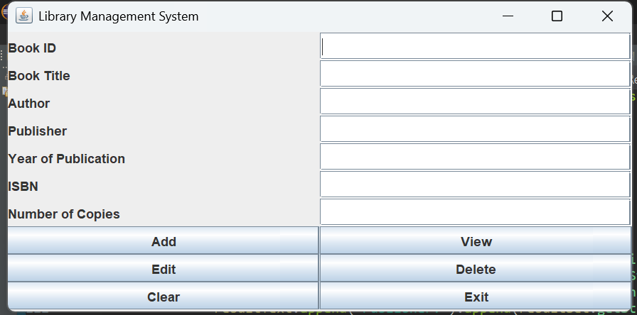
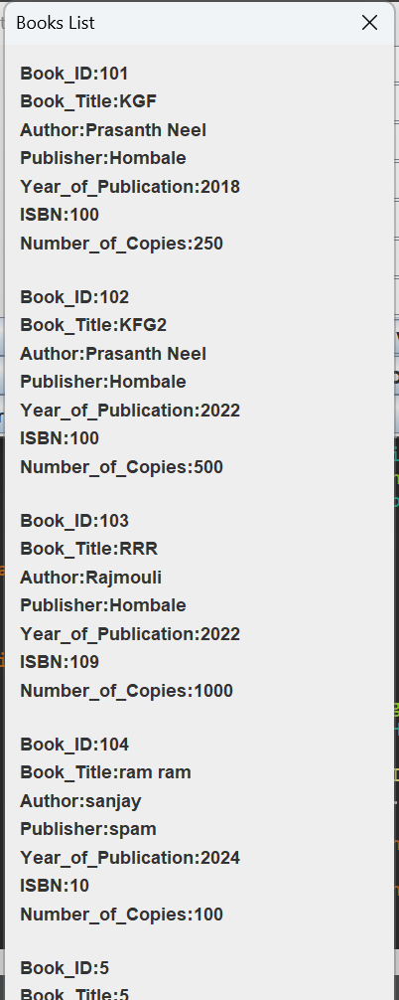

# Library Management System (Java + MySQL)

A simple Java Swing-based application to manage library books using a MySQL database.

## Features
- Add, view, edit, delete book records
- Connects to MySQL (`library_db`) using JDBC
- GUI built using `Swing`

## Screenshot
### Main Interface


### Book List Output


## Database Details

**Table:** `books`

```sql
CREATE TABLE books (
  book_id INT PRIMARY KEY,
  book_title VARCHAR(100),
  author VARCHAR(100),
  publisher VARCHAR(100),
  year_of_publication INT,
  isbn VARCHAR(50),
  number_of_copies INT
);
