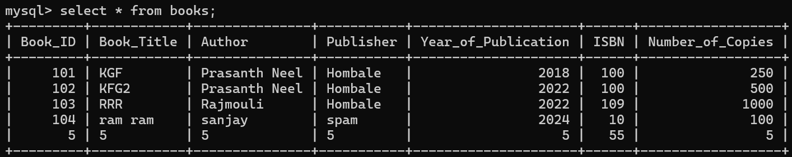
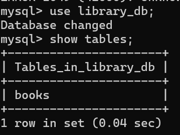

# 📚 Library Management System (Java + MySQL)

A simple Java Swing-based application for managing books in a library using a MySQL database.

---

## ✨ Features

- Add new books  
- View all books  
- Edit book details  
- Delete a book record  
- Clear input fields  
- Exit the application

---

## 🖼️ Screenshots

### 🪟 Main GUI  


### 📋 Book List (Displayed via JOptionPane)  


### 🧾 MySQL Data in `books` Table  


### 🗃️ Tables inside `library_db`  


---

## 🗃️ Database Schema (MySQL)

Use the SQL below to create your `books` table:

```sql
CREATE DATABASE IF NOT EXISTS library_db;
USE library_db;

CREATE TABLE IF NOT EXISTS books (
  book_id INT PRIMARY KEY,
  book_title VARCHAR(100),
  author VARCHAR(100),
  publisher VARCHAR(100),
  year_of_publication INT,
  isbn VARCHAR(50),
  number_of_copies INT
);
